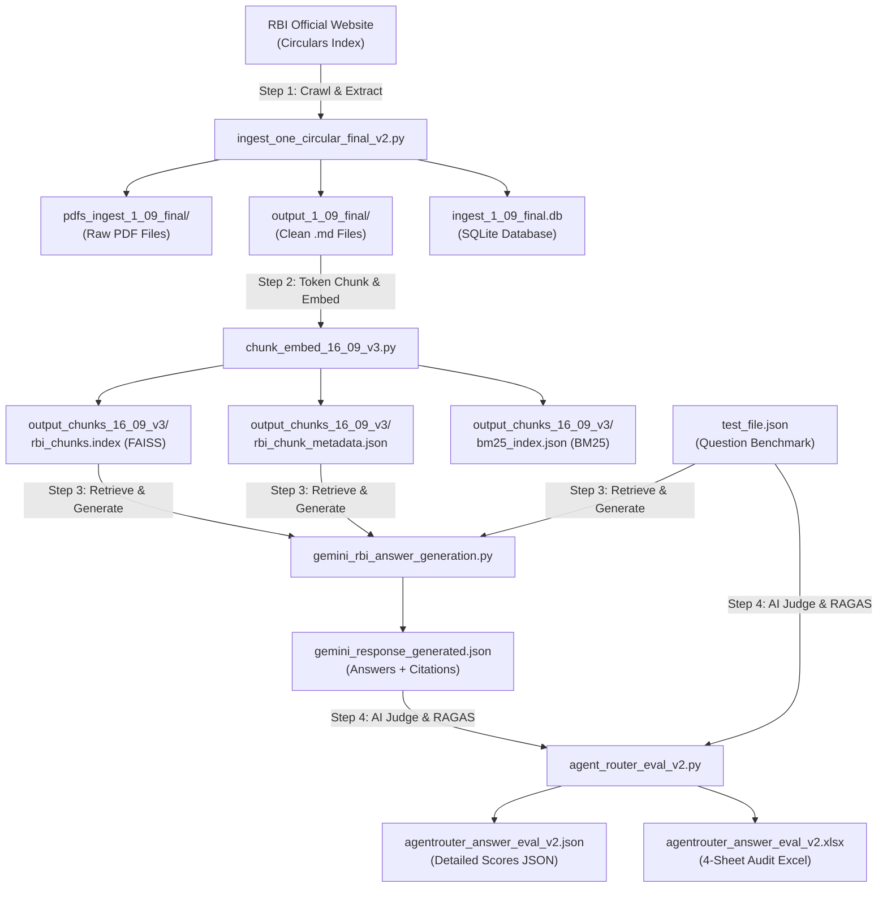

# RBI Circulars RAG & Evaluation Pipeline — Version 1 Guide

This guide explains **Version 1** of the RBI Circulars AI Pipeline in simple, plain words. It explains **what command to run at every step**, **what each file does**, and **which output file is created by which script**.

---

## 📌 High-Level Pipeline Overview

The pipeline takes official **Reserve Bank of India (RBI)** banking circulars and turns them into an accurate, verifiable Q&A system evaluated by an AI judge:



---

## ⚡ Quick Reference Table

| Step | Python Script | Purpose in Simple Words | Command to Run | Primary Inputs | Primary Outputs Generated |
| :--- | :--- | :--- | :--- | :--- | :--- |
| **Step 1** | `ingest_one_circular_final_v2.py` | Downloads circulars from RBI website, extracts clean text & tables into Markdown, and logs to SQLite. | `python ingest_one_circular_final_v2.py --limit 10` | RBI Circular Index Website | `pdfs_ingest_1_09_final/`<br/>`output_1_09_final/*.md`<br/>`ingest_1_09_final.db` |
| **Step 2** | `chunk_embed_16_09_v3.py` | Slices Markdown text into 512-token chunks, creates vector embeddings (`BGE-M3`), and builds FAISS and BM25 search indices. | `python chunk_embed_16_09_v3.py` | `output_1_09_final/*.md` | `output_chunks_16_09_v3/rbi_chunks.index`<br/>`output_chunks_16_09_v3/rbi_chunk_metadata.json`<br/>`output_chunks_16_09_v3/bm25_index.json` |
| **Step 3** | `gemini_rbi_answer_generation.py` | Finds the Top-5 relevant chunks for each test question and uses Google Gemini (`gemini-2.5-flash`) to generate accurate, cited answers. | `python gemini_rbi_answer_generation.py` | `test_file.json`<br/>`rbi_chunks.index`<br/>`rbi_chunk_metadata.json` | `gemini_response_generated.json` |
| **Step 4** | `agent_router_eval_v2.py` | Evaluates the answers using DeepSeek (`deepseek-v4-flash`) as an impartial judge across 4 RAGAS metrics. | `python agent_router_eval_v2.py` | `test_file.json`<br/>`gemini_response_generated.json` | `agentrouter_answer_eval_v2.json`<br/>`agentrouter_answer_eval_v2.xlsx` |

---

## 📖 Step-by-Step Deep Dive

> **Note on working directory**: Run all commands from inside the `V1` directory or the project root. The commands below assume you are inside the `V1` folder:
> ```bash
> cd V1
> ```

---

### Step 1: Ingestion & Text Extraction

**File**: `V1/ingest_one_circular_final_v2.py`

#### What it does in simple words:
1. Opens the official RBI Circulars Index webpage (`https://www.rbi.org.in`).
2. Collects circular metadata (Notification Number, Date, Subject, PDF links).
3. Downloads the official PDF files into the `pdfs_ingest_1_09_final/` folder.
4. Extracts clean text and formatted tables using a multi-layer strategy:
   - **HTML First**: Directly extracts tables and clean text from the circular's HTML detail page.
   - **PDF Fallback**: If HTML is unavailable, parses the PDF with `PyMuPDF` and `pdfplumber`.
   - **Vision Fallback (OCR)**: If a circular is a scanned image, uses Google Gemini Vision to transcribe the pages.
5. Normalizes dates, detects official signatories (e.g. Chief General Manager), and validates data integrity.
6. Writes a clean Markdown (`.md`) file for each circular and stores records in a local SQLite database.

#### Command to run:
```bash
# Process first 10 circulars (fast for testing):
python ingest_one_circular_final_v2.py --limit 10

# Or process default batch (up to 26 circulars):
python ingest_one_circular_final_v2.py
```

#### What outputs are generated:
* `V1/pdfs_ingest_1_09_final/`: Contains downloaded original PDF files (e.g., `RBI_2026-27_236.pdf`).
* `V1/output_1_09_final/`: Contains clean Markdown files (e.g., `RBI_2026-27_236.md`) with frontmatter metadata:
  ```markdown
  ---
  title: Master Direction – Reserve Bank of India
  date: 2026-03-15
  circular_ref_no: RBI/2026-27/236
  signatory_name: Veena Srivastava
  signatory_designation: Chief General Manager
  ---
  [Circular body text and markdown tables...]
  ```
* `V1/ingest_1_09_final.db`: SQLite database file storing raw circulars, metadata, extracted tables, and validation check logs.

---

### Step 2: Token Chunking & Vector Indexing

**File**: `V1/chunk_embed_16_09_v3.py`

#### What it does in simple words:
1. Reads all the Markdown (`.md`) files created in Step 1.
2. Slices long circulars into smaller pieces ("chunks") of **512 tokens** each, with a **100-token overlap** between adjacent chunks so context is never split awkwardly.
3. **Smart Boundary Preservation**: It does not cut words or sentences in half, and it keeps Markdown tables intact.
4. Generates mathematical vector representations ("embeddings") for each chunk using the state-of-the-art multilingual embedding model `BAAI/bge-m3`.
5. Builds two search systems:
   - **FAISS Vector Index**: For conceptual/semantic search (matching meaning).
   - **BM25 Index**: For exact keyword matching (matching exact circular numbers or financial terms).

#### Command to run:
```bash
python chunk_embed_16_09_v3.py
```

#### What outputs are generated (inside `V1/output_chunks_16_09_v3/`):
* `rbi_chunks.index`: The FAISS binary vector index file containing all chunk embeddings.
* `rbi_chunk_metadata.json`: A JSON list of all chunks, including chunk text, source file name, chunk number, token count, and character length.
* `bm25_index.json`: Keyword index file for BM25 lexical search.

---

### Step 3: Answer Generation with Google Gemini

**File**: `V1/gemini_rbi_answer_generation.py`

#### What it does in simple words:
1. Loads the benchmark questions from `V1/test_file.json`.
2. For each question, calculates its vector embedding and searches the FAISS index for the **Top-5 most relevant chunks**.
3. Bundles the retrieved circular excerpts and sends them to **Google Gemini** (`gemini-2.5-flash`).
4. Instructs Gemini to answer the question using **only facts from the retrieved chunks** and to cite the source circular number and paragraph.
5. **Multi-Key Failover**: If an API key runs into a rate limit or quota issue, it automatically tries the next available key without crashing.
6. **Atomic Checkpointing**: Saves progress to `gemini_response_generated.json` after **every single question**. You can stop the script at any time with `Ctrl+C` and resume later without losing work.

#### Command to run:
```bash
# Default run (processes questions up to default test limit):
python gemini_rbi_answer_generation.py

# To run for a custom number of questions (e.g., 5 questions):
# On Windows PowerShell:
$env:RAG_MAX_QUESTIONS="5"; python gemini_rbi_answer_generation.py

# On Linux / macOS / Git Bash:
RAG_MAX_QUESTIONS=5 python gemini_rbi_answer_generation.py

# To run for ALL questions in test_file.json:
# On Windows PowerShell:
$env:RAG_MAX_QUESTIONS="0"; python gemini_rbi_answer_generation.py
```

#### What outputs are generated:
* `V1/gemini_response_generated.json`: JSON file storing the question, ground truth, generated answer, citations, and all retrieved chunk texts with similarity scores.

---

### Step 4: AI Judge Evaluation with DeepSeek & RAGAS

**File**: `V1/agent_router_eval_v2.py`

#### What it does in simple words:
1. Takes the generated answers from `gemini_response_generated.json` and matches them with the benchmark ground truth in `test_file.json`.
2. Connects to **AgentRouter** using **DeepSeek** (`deepseek-v4-flash`) as an impartial AI judge.
3. Uses a local embedding model (`BAAI/bge-small-en-v1.5`) running 100% offline on your machine with **zero API credit cost** for semantic comparisons.
4. Grades each response across the **4 core RAGAS metrics**:
   * 🛡️ **Faithfulness (0.0 to 1.0)**: Is every statement in the answer directly supported by the retrieved text? (Detects hallucinations).
   * 🎯 **Answer Relevancy (0.0 to 1.0)**: Does the answer directly answer what was asked without wandering off-topic?
   * 🔍 **Context Precision (0.0 to 1.0)**: Did the vector search put the most relevant chunks at the very top (Rank 1 & 2)?
   * 📚 **Context Recall (0.0 to 1.0)**: Did the retrieved chunks contain all the necessary facts required by the ground truth?
5. Checkpoints after each question and exports both a JSON file and a polished **4-Sheet Excel Report**.

#### Command to run:
```bash
python agent_router_eval_v2.py
```

#### What outputs are generated:
* `V1/agentrouter_answer_eval_v2.json`: Machine-readable evaluation results for every question.
* `V1/agentrouter_answer_eval_v2.xlsx`: A comprehensive Excel spreadsheet with 4 specialized sheets:
  1. **`Detailed_Evaluation`**: Question-by-question view with side-by-side comparison, individual metric scores (Faithfulness, Relevancy, Precision, Recall), composite RAGAS average, and `PASSED` / `FAILED` status.
  2. **`Difficulty_Breakdown`**: Average scores grouped by question category (`Easy`, `Medium`, `Hard`, `Procedure`, etc.).
  3. **`Evaluation_Summary`**: Overall KPI dashboard showing total questions evaluated, pass rate (score >= 0.70), and average metrics.
  4. **`Retrieved_Chunks_Audit`**: Complete text of all chunks retrieved for each question, including rank, file name, distance score, and token count (ideal for auditing search quality).

---

## 🚀 Complete Step-by-Step Command Sequence

To run the entire pipeline from beginning to end, open your terminal and execute:

```powershell
# 1. Activate your virtual environment
.\venv312\Scripts\Activate.ps1

# 2. Navigate to the Version 1 folder
cd V1

# 3. Step 1: Download & Ingest 10 circulars
python ingest_one_circular_final_v2.py --limit 10

# 4. Step 2: Slice into chunks & create vector/keyword indices
python chunk_embed_16_09_v3.py

# 5. Step 3: Generate answers using Gemini
python gemini_rbi_answer_generation.py

# 6. Step 4: Evaluate with DeepSeek & RAGAS
python agent_router_eval_v2.py
```

---

## ❓ Frequently Asked Questions (FAQ)

### 1. What happens if my internet disconnects during Step 3 or Step 4?
Both `gemini_rbi_answer_generation.py` and `agent_router_eval_v2.py` use **atomic checkpoints**. They save every question immediately to disk. If interrupted, simply re-run the exact same command; it will detect completed questions and continue where it left off.

### 2. Can I run Step 4 without incurring high API costs?
Yes! Step 4 uses **local offline embeddings** (`BAAI/bge-small-en-v1.5`) for vector comparisons, which costs $0. Only the LLM judge calls are routed to AgentRouter (`deepseek-v4-flash`), which is extremely fast and cost-effective.

### 3. How do I inspect the results without coding?
Open `V1/agentrouter_answer_eval_v2.xlsx` in Microsoft Excel, Google Sheets, or LibreOffice Calc. The `Evaluation_Summary` sheet gives you a quick bird's-eye view, and `Detailed_Evaluation` lets you read every question and answer.
